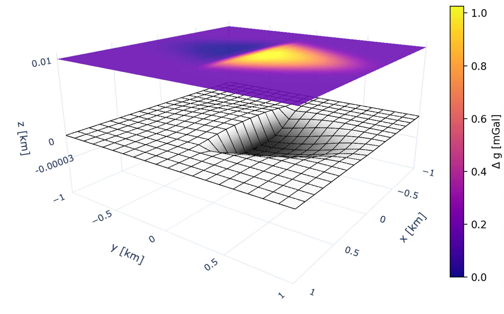

# NormalFaultGravity: Gravity Modelling of Normal Faults

Python tools to create a displacement profile of a normal fault from a handful of parameters defining its location and geometry. Then, the gravity anomaly from this fault can be computed using a Fourier domain forward modelling technique (Parker 1972).


---

## Environment Setup

This project uses **Conda** for dependency management.  
To create and activate the environment from the provided `environment.yml` file, run:

```bash
# Create the environment
conda env create -f environment.yml

# Activate the environment
conda activate faultenv

## Acknowledgements

This is a Python version of Matlab software written by Dr Gary Barnes from Metatek.
